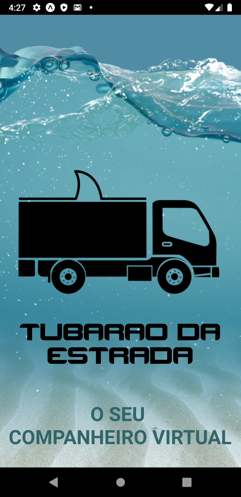

<!-- TABLE OF CONTENTS -->
# Índice
* [Sobre o Projeto](#boom-sobre-o-projeto)
* [Construído com](#gear-construído-com)
  * [Ferramentas](#ferramentas)
  * [Tecnologias](#tecnologias)
* [Começando](#rocket-começando)
  * [Prerequisitos](#clipboard-prerequisitos)
  * [Instalação](#zap-instalação)
* [Utilização](#utilização)
* [Contato](#e-mail-contato)
* [Agradecimentos](#exclamation-agradecimentos)
<!-- * [Roadmap](#arrows_clockwise-roadmap) -->

<!-- ABOUT THE PROJECT -->
# :boom: Sobre o Projeto

<!-- Project image -->
<p align="center">
  
</p>


## Descrição
Tubarão da estrada é um app desenvolvido pela equipe 450 durante o hackathon CCR 2020.
A ideia do app é servir como um assistente virtual para os caminhoneiros no intuito de ajudá-los no seu dia a dia utilizando o máximo possível de comandos de voz para que tenha uma experiência ainda melhor na utilização do app para que possa mantar o foco na estrada enquanto está dirigindo.

***

# :gear: Construído com
  ## Ferramentas
  * [VSCode](https://code.visualstudio.com/)

  ## Tecnologias
  * [Typescript](https://www.typescriptlang.org/)
  * [React Native](https://reactnative.dev/)
  * [Expo](https://expo.io/)

  [:arrow_up: Back to top](#table-of-Contents)
  ***

# :fireworks: Layout
Clique [aqui](https://www.figma.com/file/IoG9eGXVlGTyWFsg9bbHb8/Hackathon-CCR?node-id=83%3A1) para ver o layout do app no Figma.

  [:arrow_up: Back to top](#table-of-Contents)
  ***

<!-- GETTING STARTED -->
# :rocket: Começando

Para ter um cópia local e funcionando do app, siga os passos abaixo.

## :clipboard: Prerequisitos

* Node.js - [Guia de instalação](https://nodejs.org/en/download/package-manager/)
* Expo CLI - [Guia de instalação](https://docs.expo.io/get-started/installation/)
* Yarn - [Guia de instalação](https://classic.yarnpkg.com/en/docs/install/#windows-stable)

[:arrow_up: Back to top](#table-of-Contents)
***

## :zap: Instalação
Execute os comandos abaixo para instalar o app.
  ```sh
    #Clonar o projeto
    git clone

    #abrir pasta ccr-app
    cd ccr-app

    #instalar dependências
    yarn

    #iniciar o projeto
    yarn start
   ```

[:arrow_up: Back to top](#table-of-Contents)
***

<!-- USAGE EXAMPLES -->
# Utilização

Para ver a desmonstração do app clique [aqui](https://www.figma.com/proto/IoG9eGXVlGTyWFsg9bbHb8/Hackathon-CCR?node-id=83%3A1&scaling=scale-down).

***

<!-- CONTACT -->
# :e-mail: Contato

Daniel - <daniel.keterer@gmail.com>
Eduardo - <Eduardo.Nobuhiro@hotmail.com>
João Vitor - <j.vitor.mf@gmail.com>
Juliana - <juju.doux@gmail.com>
Richard - <richard.deus@gmail.com>

[:arrow_up: Back to top](#table-of-Contents)
***

<!-- ACKNOWLEDGEMENTS -->
# :exclamation: Agradecimentos

* [Hackathon CCR](http://www.grupoccr.com.br/hackathonccr/)
* [CCR](http://www.grupoccr.com.br/grupo-ccr/sobre-o-grupo-ccr)
* [Shawee](https://shawee.io/)

[:arrow_up: Back to top](#table-of-Contents)
***
